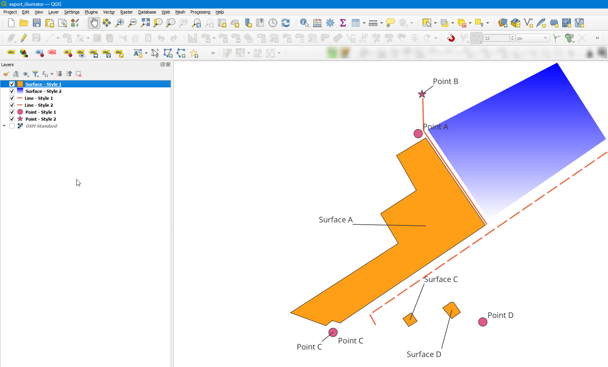
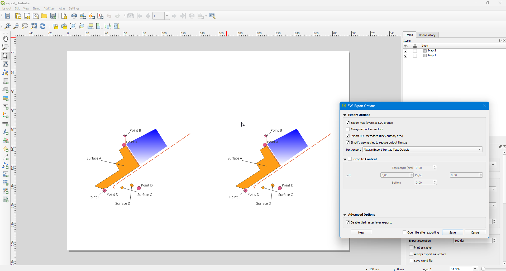
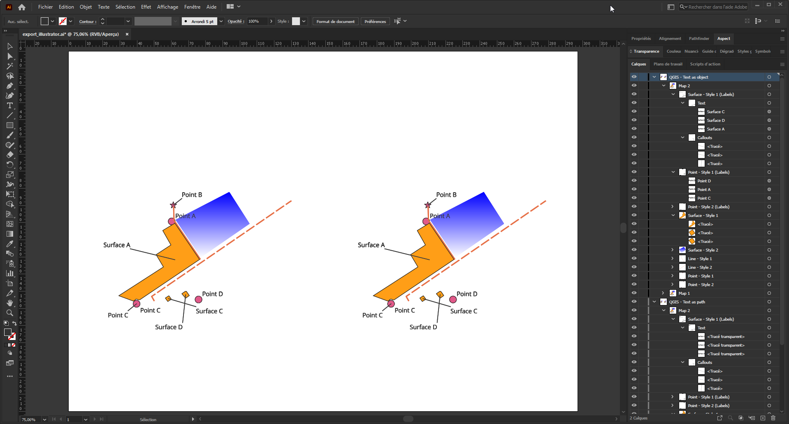
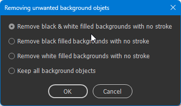

# Import SVG data from QGIS to Illustrator

This script allows you to clean the exported SVG file from the QGIS Composer when importing it into Adobe Illustrator.

From a QGIS Project :

You have to export a SVG file from the composer :

You will have a structurated Illustrator project :

# Installation
The script can be run in Illustrator in the menu "Files" => "Scripts" => "Other scripts"
If you want it to appear in the script list, it have to be placed into the Adobe Illustrator scripts folder (then reboot Illustrator) :
	Exemple on Windows : C:\Program Files\Adobe\Adobe Illustrator 2021\Presets\fr_FR\Scripts

# QGIS Configuration
The SVG need to be exported from the QGIS composer. Try to follow the following rules/advices, 
- You need to check the following option when exporting : "Export map layers as SVG Groups" ("Exporter les couches de la carte comme des groupes SVG" in french)
- You can use the option "Always export Text as text objects" to keep the possibility of managing text properties in Illustrator
- Avoid raster layers into you map.
- Strokes and symbols sizes need to be set in point or in millimeter but never in pixel to be the same into Illustrator.
- Stroke styles are kept (join, cap, dash pattern...)
- For surfaces, fill parttern are not correctly managed by the QGIS exporter process : patterns are not clipped.
- For surfaces, Shapeburst fill (gradient fill) are not supported.
- For surfaces, outlines are managed.

In general, stay simple and do your fancy style into Illustrator.

/!\ All object without any stroke and a fill color black (0,0,0) or white (255,255,255) will be removed. This is because the QGIS exporter adds a lots of background object with these two colors but with a fill opacity of 0%.
The fill opacity propertie cannot be access within the script making these background difficult to detect.
Some securities are in place : these objects have to be in specific groups so cartographic objects will not be removed but in case of trouble, you can choose to keep then during the proces :

# Testing
Open the QGIS Project into the GeoPackage nammed export_illustrator.gpkg

Export the composer "export_illustrator" to SVG file.

Open Illustrator en load the exported file using the JSX script at the root of the project.
=> You will see the data onto your project with the layers structured like in the QGIS document.

